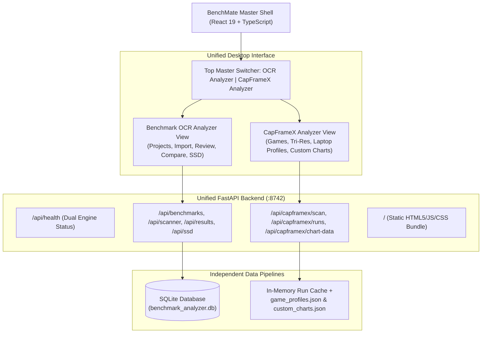

# BenchMate Analyzer & Chart Generator v1.1.1

A professional, 100% offline Windows desktop application engineered for technology reviewers at **Gadget Pilipinas**. **BenchMate Analyzer** merges the **Benchmark OCR Analyzer** and the **CapFrameX Analyzer** into a unified, high-performance workstation suite capable of running off a single standalone executable.

### 📜 Changelogs & Release Notes
- 🌐 [Master BenchMate Suite Changelog](CHANGELOG.md) (v1.1.1)
- 🔍 [Benchmark OCR Analyzer Dedicated Changelog](CHANGELOG_OCR.md) (v2.17.0)
- 🎮 [CapFrameX Analyzer Dedicated Changelog](CHANGELOG_CAPFRAMEX.md) (v1.1.1)

---

## 🌟 Key Highlights

- **Dual-Engine Architecture in a Single Executable**:
  - 🔍 **Benchmark OCR Analyzer (Main App)**: Automatically reads benchmark scores from 45+ benchmark tool screenshots using local neural OCR (RapidOCR ONNX), manages SQLite project data, comparison delta charts, and SSD master databases.
  - 🎮 **CapFrameX Analyzer (Dedicated App)**: Ingests and calculates exact frametimes (`MsBetweenPresents`) from raw CapFrameX capture JSONs, rendering Average FPS, 1% Low FPS, 0.1% Low FPS, with dual PC Components (Tri-Resolution) and Laptop (Power Profiles) modes.
- **Independent Caching & Concurrent Memory**:
  - The image/screenshot OCR pipeline and the JSON capture frametime pipeline are **100% decoupled**.
  - Reviewers can run an OCR image scan in the background while filtering games or editing frametime runs in CapFrameX without memory contention or data collision.
  - Both applications remain mounted simultaneously in the user interface—switching tabs is instantaneous with zero reload, zero state loss, and zero layout shift.
- **Multi-Monitor / Pop-Out Mode**:
  - Reviewers with dual or triple displays can click **Pop Out Window** in the top navigation bar to open either app in a dedicated secondary window (`?app=capframex` or `?app=ocr`) side-by-side.
- **Publication-Ready Bar Charts**:
  - Horizontal bar charts formatted for editorial publishing in both **16:9** (landscape website) and **9:16** (mobile/socials).
  - Branded Gadget Pilipinas corner ribbons (Blue `#1d3557` top-left, Red `#e63946` bottom-right).
  - Editorial typography using bundled **Open Sans Condensed Bold & Light** fonts.
  - Transparent PNG, high-res WebP, Tri-Resolution ZIP, and All Games ZIP batch exports.
- **Human-Readable Configurations**:
  - `game_profiles.json`: Customize default chart titles, presets, and internal test notes per game directly in Notepad.
  - `custom_charts.json`: Create and edit custom temperature, power, and battery charts with automatic hardware pre-filling.

---

## 🚀 Quick Start

### Option 1: Standalone Desktop GUI (Single Executable)
Run the pre-compiled executable directly:
```text
dist\BenchMate-Analyzer\BenchMate-Analyzer.exe
```
*(Or unzip `release\BenchMate-Analyzer-v1.0.0-Windows.zip` anywhere on your PC and double-click `BenchMate-Analyzer.exe`)*

### Option 2: Run via Batch Launcher
```bat
run_app.bat
```

### Option 3: Full Development Mode (Live Hot-Reload)
```bat
run-dev.bat
```
- Backend runs on `http://127.0.0.1:8742`
- Frontend runs on `http://localhost:5173`

---

## 🏗️ Architecture



---

## 🧪 Verification & Automated Testing

BenchMate Analyzer includes comprehensive test coverage across both engines:

1. **OCR Unit & Integration Tests**:
   ```bash
   pytest backend/tests
   ```
   *(35 passed: composite benchmarks, fuzzy matchers, SSD database, and parsers)*

2. **CapFrameX Backend Integration Tests**:
   ```bash
   python test_backend.py
   ```
   *(16 passed: runs calculation, GPU hierarchy, motherboard grouping, tri-res)*

3. **Custom Charts & Hardware Pre-fill Tests**:
   ```bash
   python test_custom_charts.py
   ```

4. **Game Profiles JSON Persistence Tests**:
   ```bash
   python test_game_profiles.py
   ```

5. **Laptop Power Profile Ingestion Tests**:
   ```bash
   python test_laptop_ingestion.py
   ```

---

## 📦 Building the Executable & Release Package

To build the production frontend, compile the standalone executable with PyInstaller, and generate the release zip:

```powershell
python package_app.py
```

Outputs:
- **Executable**: `dist/BenchMate-Analyzer/BenchMate-Analyzer.exe`
- **Release ZIP**: `release/BenchMate-Analyzer-v1.1.1-Windows.zip`

---

## 📄 License
Internal software developed for **Gadget Pilipinas** technology hardware reviews.
